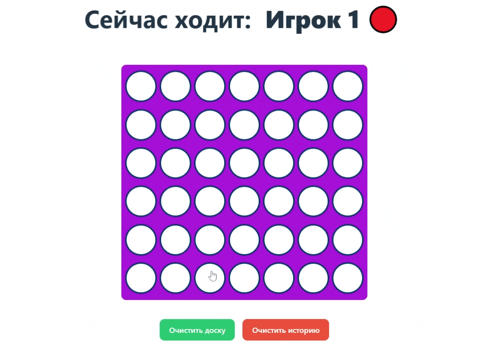
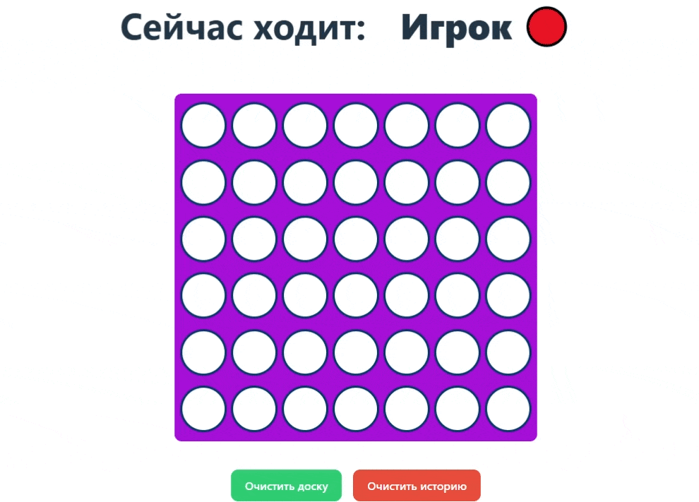

# Тестовое задание на стажировку frontend-разработчика
# Автор: [Метляков Станислав](https://github.com/MeTStIL)


## Содержание
- [Технологии](#-технологии)
- [Структура проекта](#-структура-проекта)
- [Пример игры](#-пример-игры-двух-игроков)
- [Использование](#-использование)
- [Функционал](#-функционал)
- [Сильные стороны](#-сильные-стороны-проекта)

## ⚙️ Технологии
- HTML5 / CSS3
- React 18 + TypeScript
- React Hooks (useState, useEffect, кастомные хуки)
- LocalStorage для сохранения прогресса
- Git + npm для сборки и запуска

## 🧩 Структура проекта
```text
for-in-row/
└── 📁 src/
    ├── 📁 components/      # Компоненты для игры
    ├── 📁 hooks/           # Собственные хуки
    ├── 📁 pages/           # Страницы игры
    ├── 📁 types/           # Общие типы игры
    ├── 📁 utils/           # Вспомогательные функции
    └── 📄 constants.ts     # Константы и конфигурация
```

## 🎮 Пример игры двух игроков:


## 🤖 Пример игры с ботом:


## 🚀 Использование
### Запуск игры 4 в ряд:
Перейдите в директорию
```sh
$  cd .\for-in-row
```

Установите npm зависимости:
```sh
$ npm i 
```

И запустите dev версию:
```sh
$ npm run dev
```

### Запуск validator:
В директории ./validator файл validator.ts с решением

## ✨ Функционал
- Игра для двух игроков на одном устройстве
- Игра с простым ботом
- Обозначение последнего шага
- Подсветка победной комбинации
- История игр с результатами
- Сброс доски или всей истории
- Сохранение прогресса в localStorage

## 💡 Сильные стороны проекта
- Чистая архитектура: логика, маршрутизация и компоненты разделены
- Полная типизация всех сущностей игры (игроки, доска, статус)
- Кастомные React-хуки для логики игры и работы с localStorage
- Доступный и удобный UI
- Игра сохраняется в localStorage перезагрузки страницы не страшны
- Лёгкая масштабируемость и расширение функционала

### Контакты:
- [Telegram](https://t.me/MeTStIL78) 
