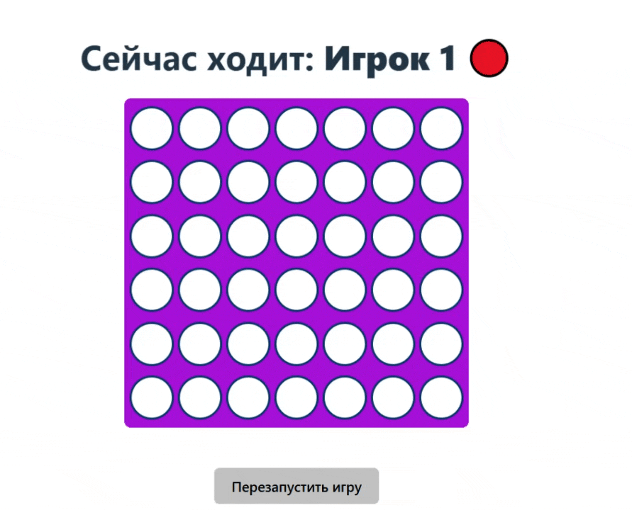

# Тестовое задание на стажировку frontend-разработчика
# Автор: [Метляков Станислав](https://github.com/MeTStIL)


## Содержание
- [Технологии](#-технологии)
- [Структура проекта](#-структура-проекта)
- [Пример игры](#-пример-игры)
- [Использование](#-использование)
- [На что обратить внимание](#-что-считаю-сильной-стороной-и-на-что-обратить-внимание)

## ⚙️ Технологии
- HTML
- CSS
- React
- TS

## 🧩 Структура проекта
```text
for-in-row/
├── 📁 src/
│   ├── 📁 components/      # Компоненты для игры
│   ├── 📁 utils/           # Вспомогательные функции
│   ├── 📁 types/           # Общие типы игры
│   ├── 📁 pages/           # Страницы игры
│   └── 📄 constants.ts     # Константы и конфигурация
└── public/                 # Статические файлы
```

## 🎮 Пример игры:


## 🚀 Использование
### Запуск игры 4 в ряд:
Перейдите в директорию
```sh
$ cd ./for-in-row
```

Установите npm зависимости:
```sh
$ npm i 
```

И запустите dev версию:
```sh
$ npm run dev
```

### Запуск validator:
В директории ./validator файл validator.ts с решением

## 💡 Что считаю сильной стороной и на что обратить внимание:
- Хорошо структурированный код: чёткое разделение логики, маршрутизации и представления.
- Использование React-хуков и чистой архитектуры компонентов.
- Полная типизация всех сущностей игры (игроки, состояние доски, статус партии).
- Приятный, юзер-френдли интерфейс с визуальной подсветкой шагов и выделением победных комбинаций.
- Код легко масштабируется

### Контакты:
- [Telegram](https://t.me/MeTStIL78) 
